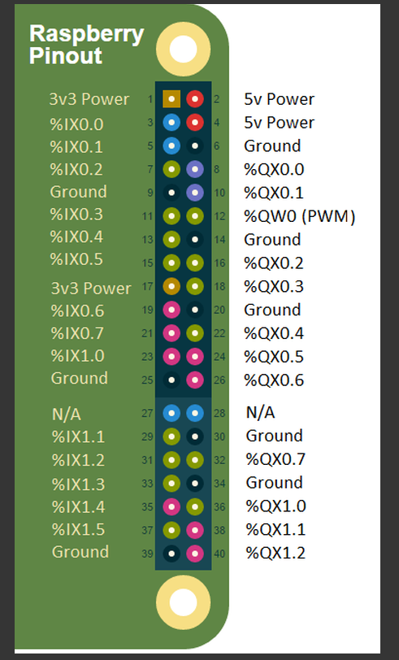

# ICS-Village-WindChallenge
If you know what this is, you are in the right place, otherwise leave...


## openplc
```bash
plcFiles/
```
contains plc files.

1) Start_Stop.st - This will be off/on once the coil is written via modbus
2) start.st - This will be on only when a rising edge is detected. False folowed by True on modbus

[openplc](https://openplcproject.com/docs/2-1-openplc-runtime-overview/)

## Pins for openplc
%IX -> input
%QX -> output

[io](https://openplcproject.com/docs/2-3-input-output-and-memory-addressing/)

These can be changed on the .st file

## GPIO pins
openplc input and output mapping to raspberry pi
[Mapping](https://openplcproject.com/docs/2-4-physical-addressing/)




scroll down to Raspberry Pi for pins mapping

## openplc runtime interface
The openplc runtime interface will run on port 8080
default login openplc password openplc

## select hardware
click on hardware after login.
click hardware and select raspberry pi

## upload openplc
[upload](https://openplcproject.com/docs/2-2-uploading-programs-to-openplc-runtime/)
click on programs on the right
click on choose program under upload program
then upload the program


#start CTF's

```bash
sudo docker-compose up
```

#stop CTF's
```bash
sudo docker-compose down
```

First time this will take time since it has to build the image
it will approximately take 10 minutes the first time


# task/CTF details will be updated
## CTF 1
openplc runtime at port 8080
modbus at port 502
plcfile - start.st

after the container is up
log in to openplc at port 8080 with default credentials
configure hardware
upload start.st file
change the default credentials in users
click start plc
close the web interface

### Solution
only on when it detects rising edge and cycle time 500ms

```python
from pymodbus.client import ModbusTcpClient

client = ModbusTcpClient('IP address')
client.connect()
while(1):
    client.write_coil(0, False)
    client.write_coil(0,True)
    sleep(0.01)
```

## CFT2
openplc runtime at port 8081
modbus at port 503
plcfile - Start_Stop.st

after container is up
log in to openplc at port 8081 with default credentials
configure hardware
upload Start_Stop.st file
change the default credentials in users
click start plc
close the web interface

### Solution
on when PB1 is on
off when PB2 is on

Note: the port number is 503


