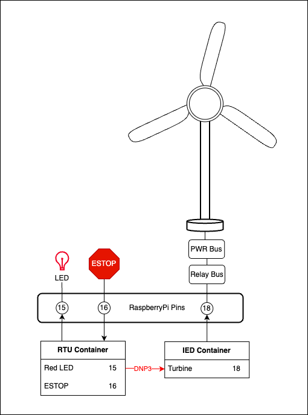

# ICS-Village-WindChallenge

## DNP3 Challenge 
There are two docker containers (RTU and IED) running OT-sim each with its own respective config.xml. 
The RTU container is being used to track the emergency stop function. The value of the switch defaults to 0 and changes to 1 to trigger the ESTOP function. 
A manual ESTOP trigger happens when the switch (GPIO 16) is pressed, the value will change to 0. The RTU reads in the switch's value then turns on the LED (GPIO 15) and sends the ESTOP signal to the IED. 
The IED container is operating the turbine (GPIO 18) the value is defaulted to 1 (running). When the IED receives na ESTOP value of 1 this shuts down the turbine (GPIO 18 -> 0). 
Normal ESTOP = red light on and turbine off. 
The goal of the attacker would be to trigger the ESTOP without the switch (i.e. artificially trigger an ESTOP). 
Attack ESTOP = red light off and turbine off. 

### Diagram 


### Solution Example 
```
code TBD
```

### Special Considerations 
* The ESTOP switch needs to be pushed down for **atleast one second** for the RTU to receive the signal and publish the value. 
* The ESTOP function clears after 1 minute. Normally an ESTOP would have to be cleared manually but for the sake of testing it will reset after the button is pressed.
* Testers might turn on the status light but the light is not the target. 
